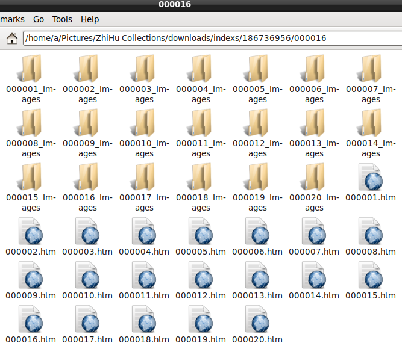
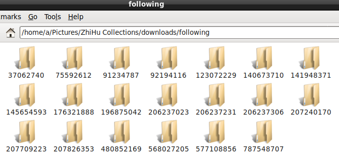

# --ZhiHu-Collections-Great-Catch
知乎收藏夾大規模抓取-ZhiHu-Collections-Great-Catch

# 系統條件

可在terminal中使用yt-dlp，並且M$WIN需要修改加上.exe後綴名。

# 使用教程

1.python -m pip install -r requirements.txt或pip install -r requirements.txt。

2.安裝好geckodriver，參照geckodriver的使用教程。

3.修改sele.py中的gong-ge-cheng-52修改為你所要抓取的知乎用戶的HTTP ID。

4.python sele.py，抓取收藏夾索引文件。

5.安裝好yt-dlp（在GitHub下載）。

6.python download.py，包括本體無JS網頁和圖片完全下載收藏夾內答案、影片、專欄、想法。

（評論因為APIv4有分鐘級QPS驗證碼限制，無法下載）

# 抓取效果

收藏夾將會從最後一項開始記錄到第一項，使用這樣的排序方式便於同步以後的收藏夾數據。
